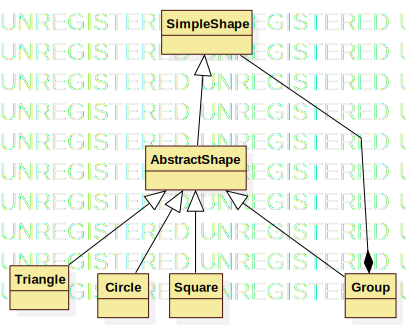
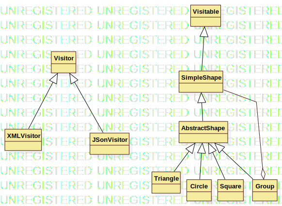

git : https://github.com/l3miage-moussola/PC_projet
BENSAADA Abdallah et MOUSSOLNA Adam

# Projet PC
## Introduction

Les buts de ce projets sont de nous faire mettre en pratique les patrons de conception vus en cours, ainsi que d'écrire du code testable, le tester correctement et d'écrire du clean code. Il s'agit également de savoir adapter du code externe et de pouvoir fournir du code utilisable par d'autres.

Le contexte de ce projet est une application de dessin et les objectifs de ce projets sont les suivants :
- poser des formes
- créer des groupes contenant des formes et/ou des groupes
- déplacer des formes et/ou groupes
- Exporter le dessin aux formats json et xml
- charger un dessin dans ces mêmes formats
- Implémenter un retour en arrière (CTRL + Z)
- Fournir un jar à un autre groupe
- intégrer le jar d'un autre groupe à notre code.

Les contraintes étaient les suivantes :
- Ne Veiller à ne pas avoir une dette technique trop importante
- Avoir une couverture de test satisfaisante
- implémenter certains patrons spécifiques (factory, composite)

## Installation
### Prérequis
- Java 17
- Maven 3.8.1

## Utilisation
### Poser une forme
Selectionnez la forme que vous souhaitez déposer, puis cliquez sur la zone blanche à l'enroit où vous souhaitez
la déposer.

### Déplacer une forme
Un simple drag and drop sur la forme.

### Créer un groupe
Cliquez sur "Create Group", cliquez sur toutes les formes que vous souhaitez insérer dans votre groupe, et cliquez à nouveau sur "create group" pour sortir du mode "création de groupe".

### Déplacer un groupe
Idem que pour déplacer une forme : drag and drop à partir d'une forme du groupe.

### Exporter le dessin
Pour exporter le dessin, il suffit de cliquer sur "XML" ou sur "JSON" selon le format d'export souhaité.

### Charger un dessin
Pour charger un dessin, il suffit de cliquer sur "Import" puis de selectionner le fichier à importer..

### Clear
Pour supprimer toutes les formes sur l'espace de dessin, cliquez sur "clear"

### Ajouter une autre forme
Pour ajouter une autre forme, cliquez sur l'icone jaune (icône chantier), puis selectionnez l'image png correspondant à la forme souhaitée. Nous vous avons fourni l'image de notre groupe ".\src\main\resources\edu\uga\miage\m1\polygons\gui\images\g1_5.png" pour vos tests.
Pour déplcer cette forme, il faut drag and drop depuis l'angle supérieur gauche de cette image.

## Documentation de conception
- Visiteur (pour l'enregistrement du dessin en XML ou JSON)
- Composite (pour la gestion des groupes)
- Factory (pour la création des formes)

### Patron composite

### Patron visiteur

### Patron Factory
Il est utilisé pour la création des formes.
Il fonctionne comme suit : il s'agit d'une classe : `ShapeFactory` qui possède une méthode `createShape` qui dispose de plusieurs méthodes statiques
qui permettent de créer les différentes formes.

## Corrections apportées depuis la dernière itération

N'ayant pas réussi à implémenter correctement les attendus précédents dans le temps imparti, nous avons passé du temps de cette itération à la corrections des points suivants :
Création d'un groupe, réimplémentation du patron composite, modification de ImportFiles, implémentation du "clear" et ajout de documents de conception.

## Dette technique et couverture de tests
Contrairement à l'itération précédente durant laquelle nous nous étions trop concentrés sur le fait d'avoir une dette technique à 0 et une couverture de tests validée par sonar, nous n'avons cette fois pas réussi à utiliser sonar.
Le fait de changer d'IDE (Eclipse vers IntelliJ) nous a facilité l'utilisation de git et toutes les démarches de configuration de projet et de génération de jar. Cependant, nous n'avons pas retrouvé comment analyser sur sonar.
Nous avons donc fait le choix cette fois-ci de nous concentrer sur la correction des problèmes des itérations précédentes.

## Conclusion

En ce qui concerne les attendus : les features principales fonctionnent : Poser des formes, créer des groupes, déplacer des formes, déplacer des groupes, exporter au format JSon, exporter au format XML, importer un dessin et génerer un jar. 
Regard critique sur notre production : Les contraintes ne sont pas toutes respectées. Les patrons de conceptions imposés ont été utilisés, mais la dette technique n'a pas été analysée durant cette dernière itération. Les tests n'ont pas été implémentés non plus. L'utilisation de notre application n'est pas agréable à cause de la disparition des formes durant un drag and drop. Il manque également l'utilisation du travail d'un autre groupe.
Reflexions sur les causes de ces limites : Le retard considérable pris durant l'itération précédente nous a laissé un choix dificile entre poursuivre le projet sans les fonctionalités de base ou rattraper notre retard mais ne pas pouvoir adresser les tâches assignées pour la dernière itération.
le fait de rattraper notre retard sur certains points nous en a fait prendre encore plus sur d'autres. Le temps passé à faire fonctionner ce qui ne fonctionnait pas durant les dernières itérations et à refactorer n'a pas pu être utilisé pour les tests ni pour l'intégration du jar de l'autre groupe.
Finalement, ce projet nous a permis d'expérimenter différents patrons de conception et de constater qu'il est difficile de concilier fonctionalité, maintenabilité, clean code, testabilité et documentation en même temps.

